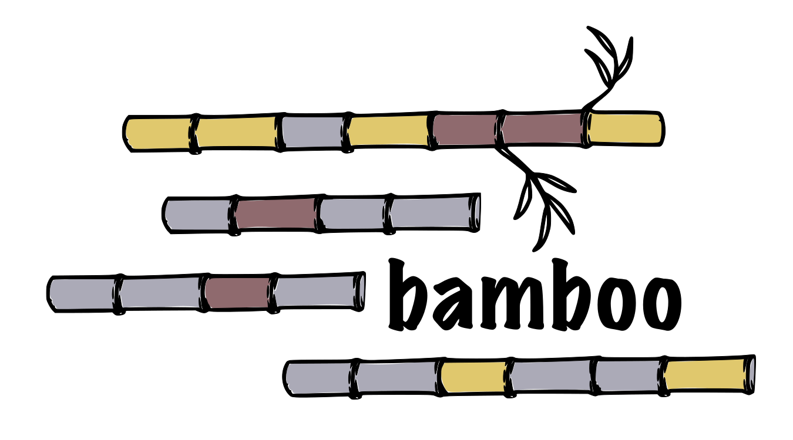

# 

A tool for creating alignment plots from bam files. The generated [vega-lite](https://vega.github.io/vega-lite/) plots are written to stdout per default.

## Usage

```bamboo -b path/to/my.bam -r path/to/my/reference.fa -g chr1:200-300 > plot.vl.json```

### Arguments

The following options are available when using bamboo:

| argument         | short | explanation                                                                                                 | default |
|------------------|-------|-------------------------------------------------------------------------------------------------------------|--------|
| bam_path         | -b    | The bam file to be visualized.                                                                              |        |
| reference        | -r    | The path to the reference fasta file                                                                        |        |
| region           | -g    | Chromosome and region for the visualization. Example: 2:132424-132924                                       |        |
| max-read-depth   | -d    | Set the maximum rows of reads that will be shown in the alignment plots                                     | 500    |
| output           | -o    | If present, data and vega-lite specs of the generated plot will be split and written to the given directory |        |
| spec-output      |       | If present vega-lite specs will be written to the given directory                                           |        |
| read-data-output |       | If present read data will be written to the given directory                                                 |        |
| ref-data-output  |       | If present reference data will be written to the given directory                                            |        |


## Authors

* [Felix Wiegand](https://github.com/fxwiegand)
* [Johannes Köster](https://github.com/johanneskoester) (https://koesterlab.github.io)
